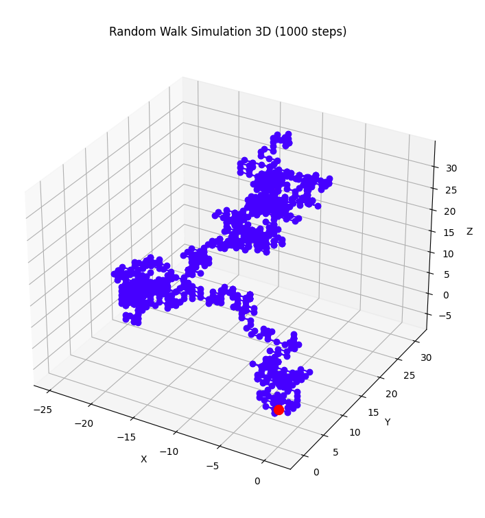
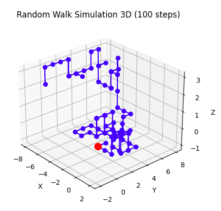
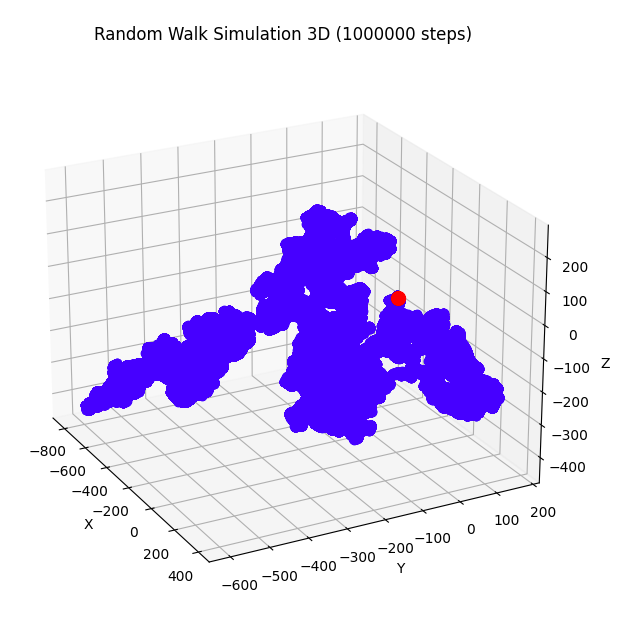

# Random Walk 3D

Este es un proyecto de simulación de un random walk tridimensional en Python. El random walk es un modelo matemático que describe un camino formado por una sucesión de pasos aleatorios. Este programa simula un random walk en tres dimensiones utilizando lanzamientos de dados simulados.

El concepto de random walk es fundamental en diversos campos, desde la física hasta la economía. Un ejemplo clásico de random walk se encuentra en las lecturas de Física de Richard Feynman, donde describe el movimiento de una partícula en un gas como una secuencia de pasos aleatorios. En su versión más simple, el random walk puede modelarse lanzando una moneda: si sale cara, la partícula avanza un paso hacia adelante; si sale cruz, retrocede un paso.


En la imagen anterior se muestra el movimiento browniano de partículas de tinta en un recipiente con agua, un tipo de random walk continuo en el que los pasos son pequeños y aleatorios.

En este proyecto, utilizamos un dado de seis caras para simular el random walk tridimensional. Cada lanzamiento del dado determina una de seis posibles direcciones de movimiento: hacia adelante, hacia atrás, hacia la izquierda, hacia la derecha, hacia arriba o hacia abajo en el espacio tridimensional.

Si el dado muestra un 1, la partícula se mueve un paso hacia adelante.
Si muestra un 2, retrocede un paso.
Si muestra un 3, se mueve un paso hacia la izquierda.
Si muestra un 4, se mueve un paso hacia la derecha.
Si muestra un 5, sube un paso.
Si muestra un 6, baja un paso.
Este programa permite simular el random walk en tres dimensiones con un número ajustable de pasos y visualizar el camino resultante en un gráfico tridimensional.

## Funcionalidades

- Simulación de un random walk en 3D con un número ajustable de pasos.
- Visualización del random walk en un gráfico tridimensional.

## Cómo usar

1. Clona o descarga el repositorio.
2. Asegúrate de tener instaladas las bibliotecas necesarias: `matplotlib` y `numpy`.
3. Ejecuta el script `random_walk_3D.py`.
4. Ajusta el número de pasos en la simulación modificando la variable `num_steps`.
5. Observa la visualización del random walk en 3D.

## Ejemplo de uso

```python
# Definimos la cantidad de pasos en el "random walk" 3D
num_steps = 10000

# Simulamos el "random walk" 3D
walk_positions_3D = random_walk_3D(num_steps)

# Graficamos el resultado
plot_random_walk_3D(walk_positions_3D, num_steps)

```
## Algunos ejemplos
A continuación se muestran algunos ejemplos para 10, 100, 1000 y 1M pasos.



 


## Contribuir
Si deseas contribuir a este proyecto, puedes hacer lo siguiente:

Mejorar la eficiencia del código.
Agregar nuevas funcionalidades, como la opción de cambiar la probabilidad de movimiento en cada dirección.
Corregir errores o mejorar la documentación.
¡Todas las contribuciones son bienvenidas! Si tienes alguna idea o sugerencia, no dudes en abrir un problema o enviar una solicitud de extracción.

## Licencia
Este proyecto está licenciado bajo la Licencia MIT. Consulta el archivo LICENSE para obtener más información.
