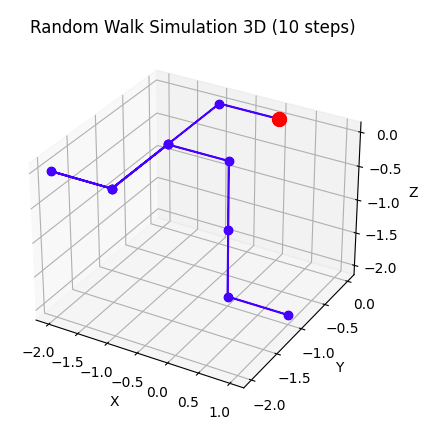

# Random Walk 3D

Este es un proyecto de simulación de un random walk tridimensional en Python. El random walk es un modelo matemático que describe un camino formado por una sucesión de pasos aleatorios. Este programa simula un random walk en tres dimensiones utilizando lanzamientos de dados simulados.

## Funcionalidades

- Simulación de un random walk en 3D con un número ajustable de pasos.
- Visualización del random walk en un gráfico tridimensional.

## Cómo usar

1. Clona o descarga el repositorio.
2. Asegúrate de tener instaladas las bibliotecas necesarias: `matplotlib` y `numpy`.
3. Ejecuta el script `random_walk_3D.py`.
4. Ajusta el número de pasos en la simulación modificando la variable `num_steps`.
5. Observa la visualización del random walk en 3D.

## Ejemplo de uso

```python
# Definimos la cantidad de pasos en el "random walk" 3D
num_steps = 10000

# Simulamos el "random walk" 3D
walk_positions_3D = random_walk_3D(num_steps)

# Graficamos el resultado
plot_random_walk_3D(walk_positions_3D, num_steps)

```
## Algunos ejemplos
A continuación se muestran algunos ejemplos para 10, 100, 1000 y 1M pasos.

 
 


## Contribuir
Si deseas contribuir a este proyecto, puedes hacer lo siguiente:

Mejorar la eficiencia del código.
Agregar nuevas funcionalidades, como la opción de cambiar la probabilidad de movimiento en cada dirección.
Corregir errores o mejorar la documentación.
¡Todas las contribuciones son bienvenidas! Si tienes alguna idea o sugerencia, no dudes en abrir un problema o enviar una solicitud de extracción.

## Licencia
Este proyecto está licenciado bajo la Licencia MIT. Consulta el archivo LICENSE para obtener más información.
